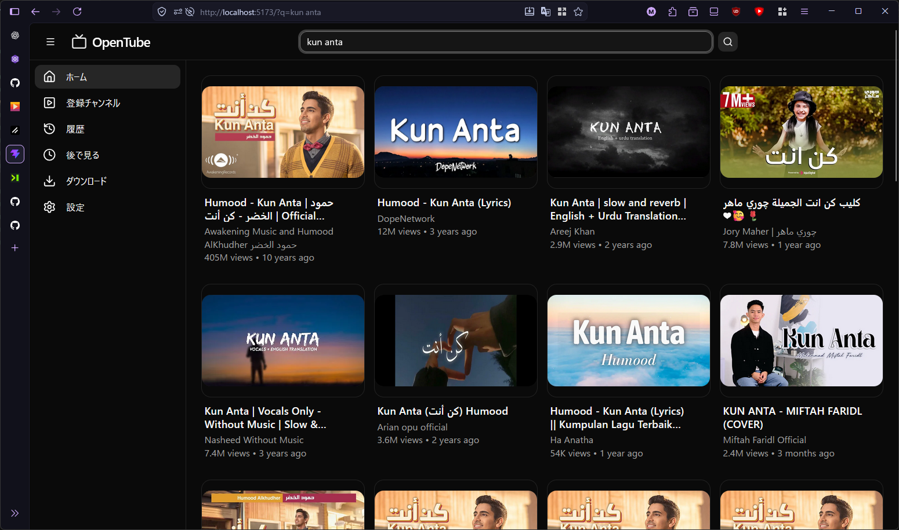
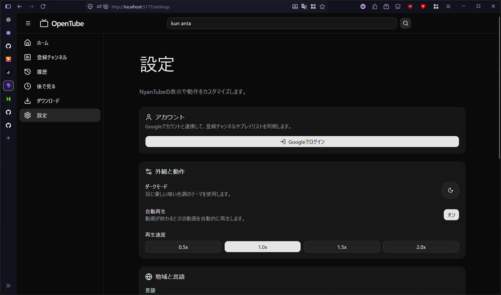
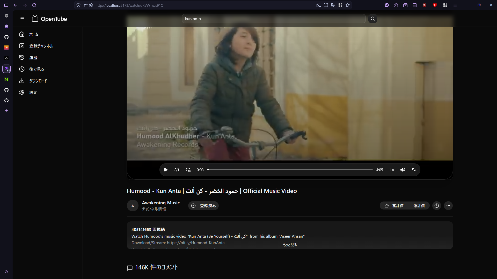

# OpenTube

OpenTube is an open-source YouTube client focused on privacy, simplicity, and user control.

No Google account.
No tracking.
No ads.
No algorithms deciding what you should watch.

OpenTube lets you browse and watch YouTube content while keeping your subscriptions, watch history, playlists, and settings entirely on your own device.

The goal is simple:

> You should be able to watch YouTube without giving up control of your data.

All user data is stored locally. Nothing is uploaded to OpenTube servers because there are no OpenTube servers.

OpenTube is designed for people who want a cleaner and more customizable YouTube experience without sacrificing performance.

Future versions will also support YouTube Music.





---

## Why OpenTube Exists

Modern web platforms increasingly rely on:

- User tracking
- Personalized profiling
- Advertising networks
- Recommendation manipulation
- Mandatory accounts

OpenTube takes a different approach.

Instead of building another social platform, OpenTube acts as a local-first client that gives users direct access to content while remaining in control of their own data.

Your subscriptions belong to you.

Your watch history belongs to you.

Your playlists belong to you.

Your settings belong to you.

Not to a cloud service.

Not to an advertising company.

Not to an algorithm.

---

## Features

### Current

- Watch YouTube videos without a Google account
- No advertisements
- Local-only subscriptions
- Local watch history
- Watch Later support
- Offline downloads
- Fast video playback
- YouTube-style interface
- Privacy-focused design

### Planned

- YouTube Music support
- Channel pages
- Playlist management
- Advanced search filters
- Import / Export subscriptions
- Enhanced player controls
- SponsorBlock integration
- Return YouTube Dislike support
- Mobile application
- Desktop application
- Plugin system

---

## Philosophy

OpenTube follows a few simple principles:

### Local First

Your data stays on your device.

### Account Optional

You should not need an account just to watch videos.

### No Tracking

OpenTube does not collect analytics or user behavior data.

### No Ads

Content should not be hidden behind advertising.

### User Control

The user decides how the application behaves.

Not an algorithm.

---

## Technology

### Core

- Preact
- Vite
- TypeScript
- Bun

### Video and API

- youtubei.js
- video.js
- @videojs/react

### UI

- TailwindCSS
- shadcn/ui
- Radix UI
- Lucide

### Storage

- Dexie.js

---

## Development

Install dependencies:

```bash
bun install
```

Start frontend:

```bash
bun run dev
```

Start backend:

```bash
bun run server
```

Build:

```bash
bun run build
```

---

## Roadmap

### Implemented

- [x] Basic UI
- [x] Routing
- [x] Video Playback
- [x] Search
- [x] Comments
- [x] Channel Information
- [x] Offline Downloads
- [x] Watch Later
- [x] Accountless Support
- [x] Ad-Free Experience

### In Progress

- [ ] Channel Pages
- [ ] Subscription Management
- [ ] Watch History
- [ ] Settings
- [ ] YouTube Music

### Future

- [ ] Desktop App
- [ ] Mobile App
- [ ] Plugin System
- [ ] SponsorBlock
- [ ] Return YouTube Dislike